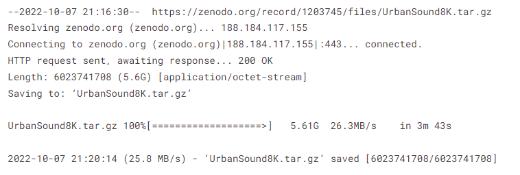
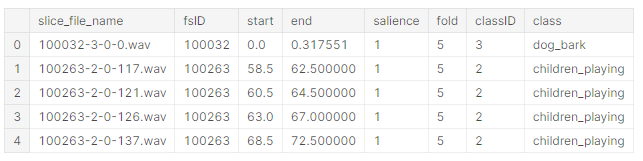
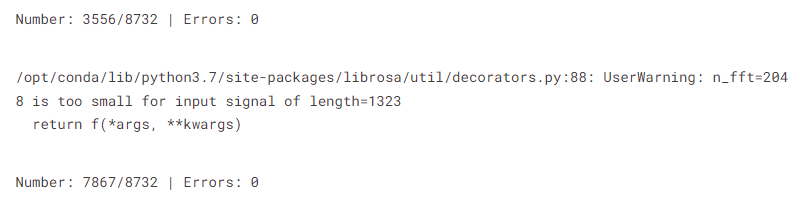
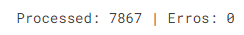
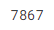
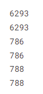
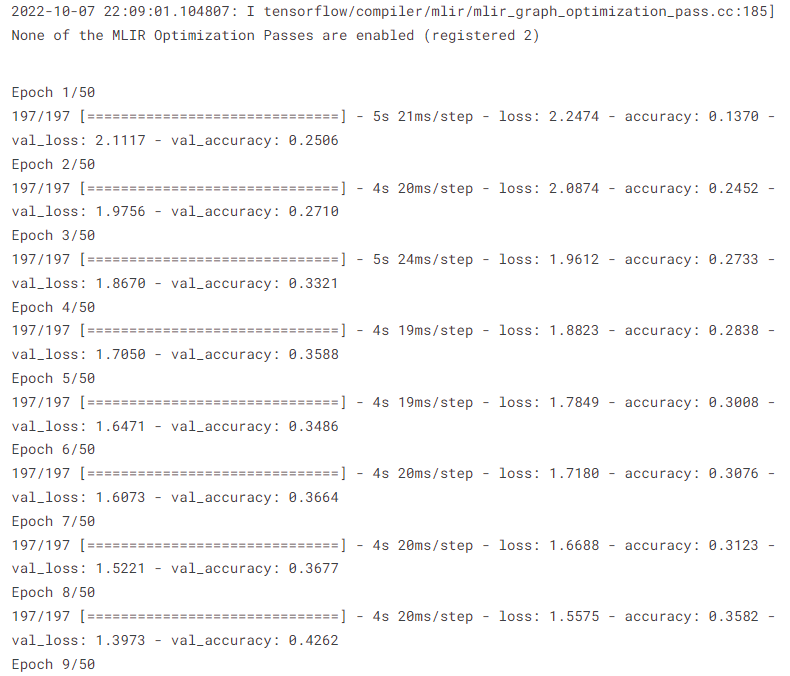
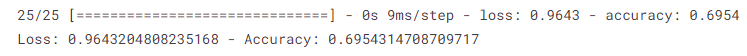
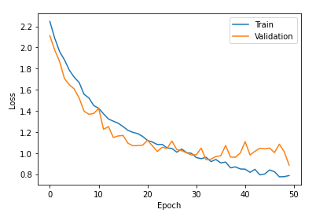
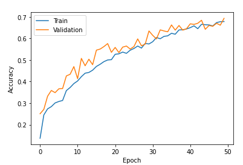

# Urban_Sounds_Classification_Global_AI_Hub
Koç Holding Derin Öğrenme Bootcamp

###### DOĞRU ÇÖZÜMÜ

[Projenin çözüm sahibi](https://www.kaggle.com/code/alpsarica/urban-sounds-classification)
## Downloading and Extracting the Dataset

```
!wget https://zenodo.org/record/1203745/files/UrbanSound8K.tar.gz
tar -xf UrbanSound8K.tar.gz
```


## Imports

```
import os
import random
import pickle

import pandas as pd
import numpy as np
import matplotlib.pyplot as plt

import librosa
import librosa.display
import cv2 as cv
import tensorflow as tf

```
## Creating Spectrograms

```
def create_spectrogram(y):
    spec = librosa.feature.melspectrogram(y=y)
    spec_conv = librosa.amplitude_to_db(spec, ref=np.max)
    return spec_conv


def save_spectrogram(spectrogram, file_name, classid):
    if str(classid) not in os.listdir("spectrograms"):
        os.mkdir(f"spectrograms/{classid}")

    save_name = file_name.split(".")[0]
    
    plt.figure()
    librosa.display.specshow(spectrogram)
    plt.savefig(f"spectrograms/{classid}/{save_name}.png", bbox_inches="tight", pad_inches=0)
    plt.close()
```
```
df = pd.read_csv("UrbanSound8K/metadata/UrbanSound8K.csv")
df.head()
```

```
path_to_folds = "UrbanSound8K/audio"

if "spectrograms" not in os.listdir():
    os.mkdir("spectrograms")

number_of_files = df.shape[0]
number_of_processed = 0
number_of_errors = 0


with open("errors.txt", "w") as error_file:
    for index, row in df.iterrows():
        try:
            file_name = row["slice_file_name"]
            fold = row["fold"]
            classid = row["classID"]
            path_to_file = f"{path_to_folds}/fold{fold}/{file_name}"
                        
            data, sr = librosa.load(path_to_file)
            spectrogram = create_spectrogram(data)
            save_spectrogram(spectrogram, file_name, classid)
            
            del data
            del sr
            del spectrogram
            
        except Exception as e:
            number_of_errors += 1
            error_file.write(f"{number_of_errors}: {e}\n")
        
        finally:
            number_of_processed += 1
        
        print(f"\rNumber: {number_of_processed}/{number_of_files} | Errors: {number_of_errors}", end="")
```


## Preprocessing

```
images = []
number_of_errors = 0
number_of_processed = 0

for classid in os.listdir("spectrograms"):
    path_to_class = f"spectrograms/{classid}"
    for image in os.listdir(path_to_class):
        try:
            path_to_image = f"{path_to_class}/{image}"
            
            img = cv.imread(path_to_image, 0)
            img = cv.resize(img, (128,128))
            img = img/255
            images.append([img, int(classid)])
            number_of_processed += 1

        except:
            number_of_errors += 1
        
        print(f"\rProcessed: {number_of_processed} | Erros: {number_of_errors}", end="")
```

```
len(images)
```

```
for _ in range(10):
    random.shuffle(images)
```

```
X = []
y = []

for image, idx in images:
    X.append(image)
    y.append(idx)
```

```
X_train = []
y_train = []

X_val = []
y_val = []

X_test = []
y_test = []
```

```
X_train = X[:6293]
y_train = y[:6293]

X_val = X[6293:7079]
y_val = y[6293:7079]

X_test = X[7079:]
y_test = y[7079:]
```

```
print(len(X_train))
print(len(y_train))
print(len(X_val))
print(len(y_val))
print(len(X_test))
print(len(y_test))
```

```
X_train = np.array(X_train)
y_train = np.array(y_train)

X_val = np.array(X_val)
y_val = np.array(y_val)

X_test = np.array(X_test)
y_test = np.array(y_test)
```

```
X_train = X_train.reshape(-1, 128, 128, 1) 
X_val = X_val.reshape(-1, 128, 128, 1) 
X_test = X_test.reshape(-1, 128, 128, 1) 
```

```
if "pickles" not in os.listdir():
    os.mkdir("pickles")

with open("pickles/X_train.pickle", "wb") as f:
  pickle.dump(X_train, f)  
with open("pickles/y_train.pickle", "wb") as f:
  pickle.dump(y_train, f)

with open("pickles/X_val.pickle", "wb") as f:
  pickle.dump(X_val, f)  
with open("pickles/y_val.pickle", "wb") as f:
  pickle.dump(y_val, f)

with open("pickles/X_test.pickle", "wb") as f:
  pickle.dump(X_test, f)  
with open("pickles/y_test.pickle", "wb") as f:
  pickle.dump(y_test, f)
```
## Model Training
```
# Model
model = tf.keras.Sequential()

# Feature Extraction
model.add(tf.keras.layers.Conv2D(32, kernel_size=(3,3), strides=(2,2), padding="same", input_shape=(128, 128, 1)))
model.add(tf.keras.layers.MaxPool2D(pool_size=(2,2), strides=(2,2)))

model.add(tf.keras.layers.Conv2D(32, kernel_size=(3,3), strides=(2,2), padding="same", activation="relu"))
model.add(tf.keras.layers.MaxPool2D(pool_size=(2,2), strides=(2,2)))
model.add(tf.keras.layers.Conv2D(32, kernel_size=(3,3), strides=(2,2), padding="same", activation="relu"))
model.add(tf.keras.layers.MaxPool2D(pool_size=(2,2), strides=(2,2)))

# Flatten
model.add(tf.keras.layers.Flatten())

# Classification
model.add(tf.keras.layers.Dense(64, activation="relu"))
model.add(tf.keras.layers.Dropout(0.5))
model.add(tf.keras.layers.Dense(64, activation="relu"))
model.add(tf.keras.layers.Dropout(0.5))
model.add(tf.keras.layers.Dense(64, activation="relu"))
model.add(tf.keras.layers.Dropout(0.5))
model.add(tf.keras.layers.Dense(64, activation="relu"))
model.add(tf.keras.layers.Dropout(0.5))
# Output Layer
model.add(tf.keras.layers.Dense(10, activation="softmax"))

```

```
model.compile(optimizer='adam', loss="sparse_categorical_crossentropy", metrics=['accuracy'])
```

```
history = model.fit(X_train, y_train, epochs=50, validation_data=(X_val, y_val))
```

```
result = model.evaluate(X_test, y_test)
print(f"Loss: {result[0]} - Accuracy: {result[1]}")
```


```
plt.plot(history.history["loss"], label="Train")
plt.plot(history.history["val_loss"], label="Validation")

plt.xlabel("Epoch")
plt.ylabel("Loss")

plt.legend()
plt.show()

```

```
plt.plot(history.history["accuracy"], label="Train")
plt.plot(history.history["val_accuracy"], label="Validation")

plt.xlabel("Epoch")
plt.ylabel("Accuracy")

plt.legend()
plt.show()
```

